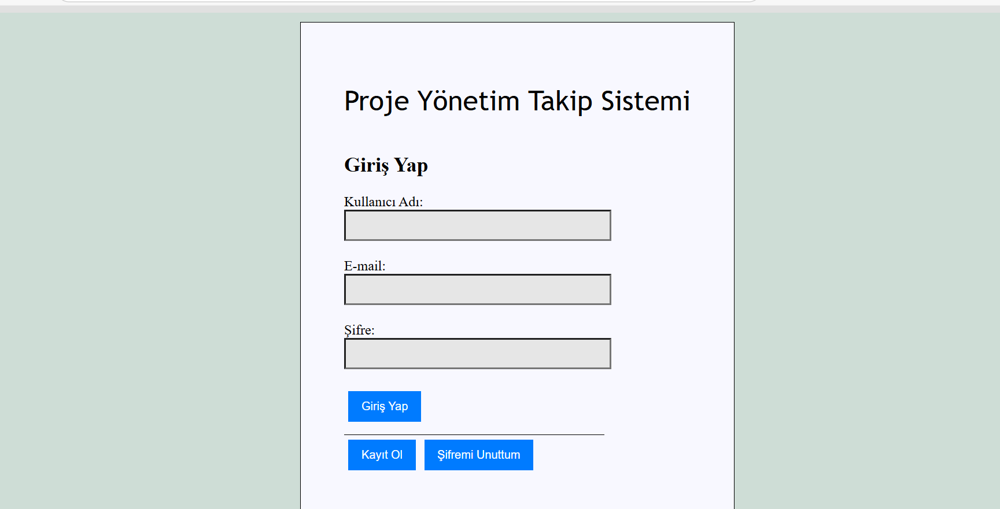
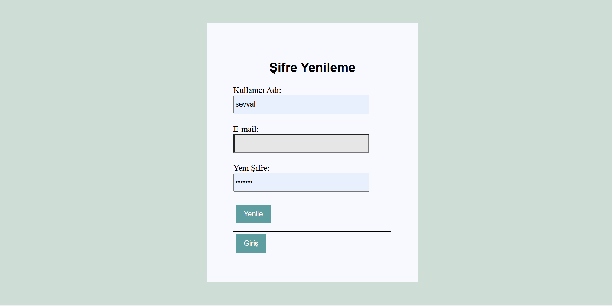
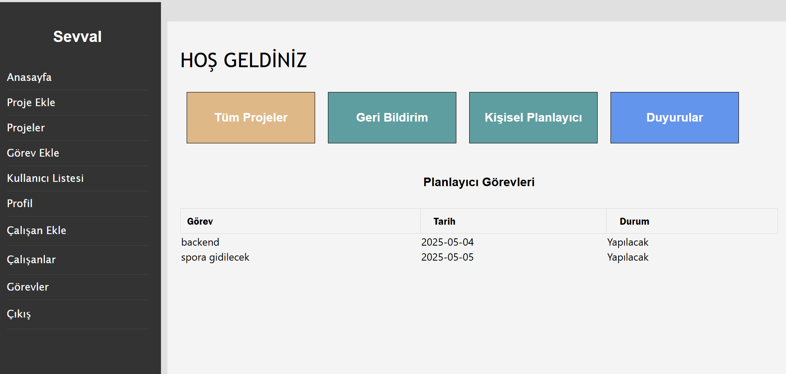
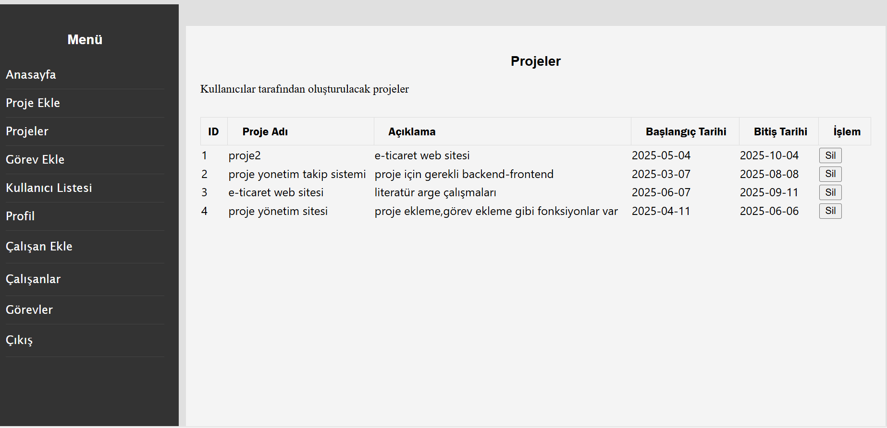
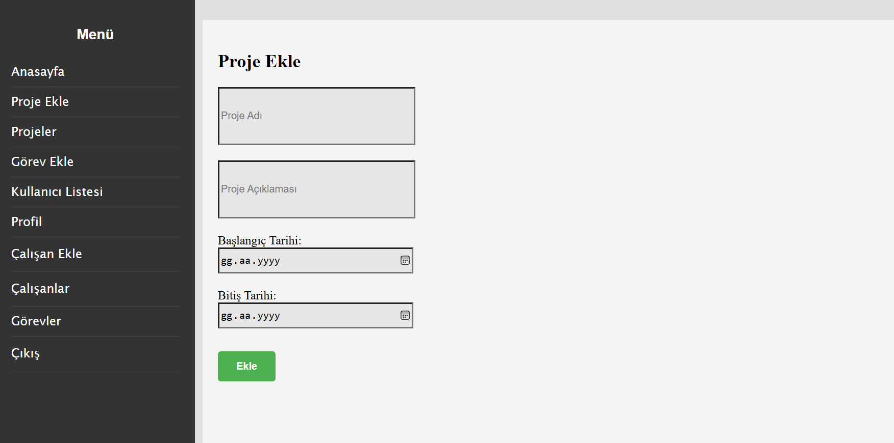
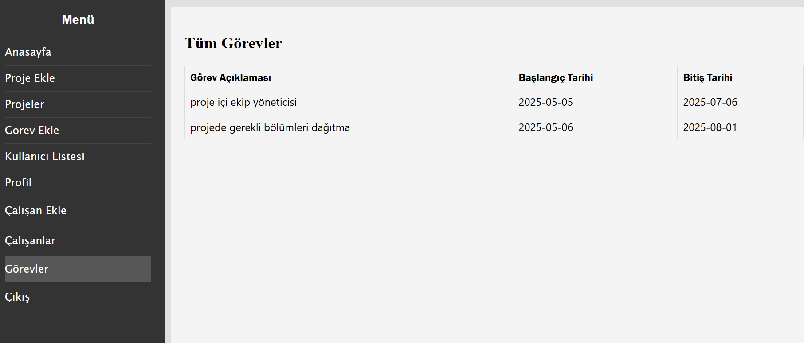
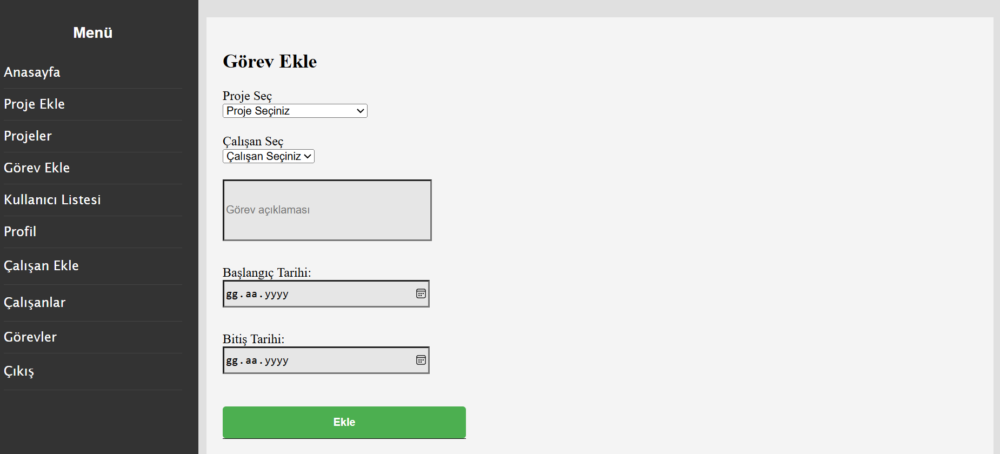
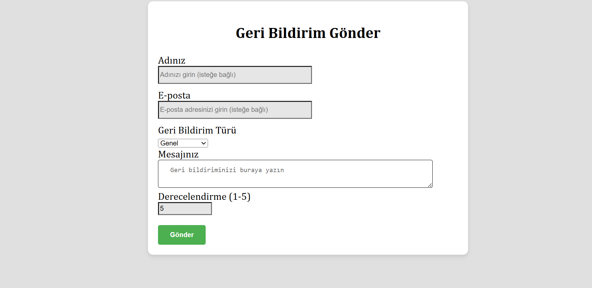
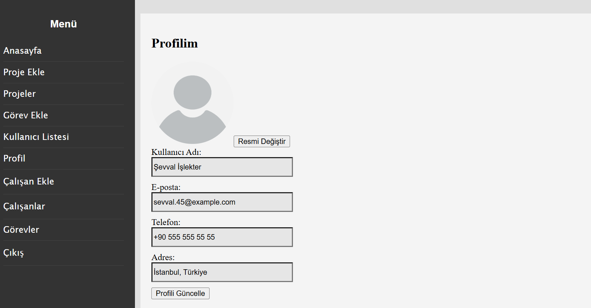

# Proje Yönetim Sistemi

Bu proje, basit bir proje yönetim uygulamasıdır. Kullanıcıların projeleri, görevleri ve bu görevlere atanan kullanıcıları yönetmesine olanak sağlar. Uygulama, kullanıcı arayüzü (frontend) ve sunucu tarafı (backend) bileşenlerinden oluşmaktadır.

## 🚀 Özellikler

- Proje oluşturma, düzenleme ve silme
- Görev oluşturma ve projelere atama
- Görevlere kullanıcı atama
- Kullanıcı yönetimi
- Veritabanı ile etkileşimli yapı

## 🛠️ Kullanılan Teknolojiler

- **Frontend:** HTML, CSS, JavaScript
- **Backend:** PHP
- **Veritabanı:** MySQL
- **Geliştirme Ortamı:** XAMPP

## 📁 Proje Yapısı


## 🖼️ Ekran Görüntüleri


## 🖼️ Ekran Görüntüleri

### Giriş Sayfaları
- 
- 
- 

### Anasayfa
- 

### Proje İşlemleri
- 
- 

### Görev İşlemleri
- 
- 

### Çalışanlar
- 
- 

### Kullanıcılar
- 

### Diğer Sayfalar
- 
- 
- 

## 🔧 Kurulum

1. Bu repoyu kendi bilgisayarınıza klonlayın:
   ```bash
   git clone https://github.com/sevvalislekter/ProjeYonetimSistemi.git


1. Bu repoyu kendi bilgisayarınıza klonlayın:
   ```bash
   git clone https://github.com/sevvalislekter/ProjeYonetimSistemi.git
